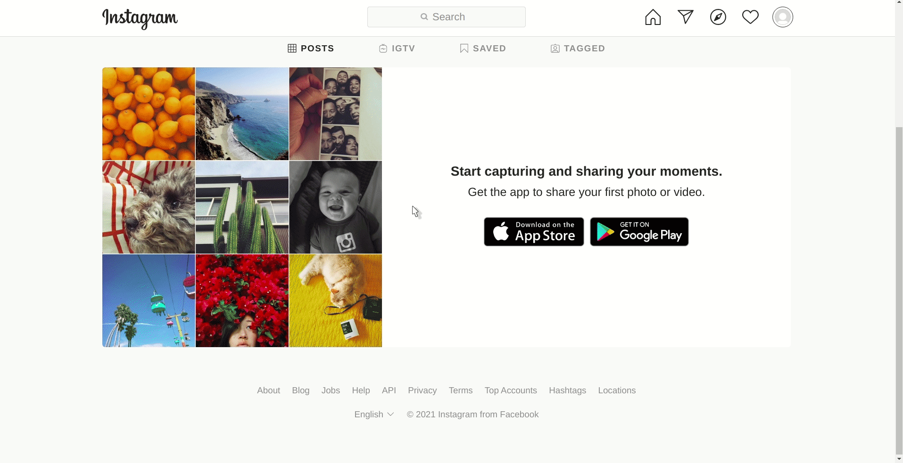

<!-- headings -->

<h1 align="center"> Instagramy </h1>

<p align="center">Python Package for Instagram Without Any external dependencies</p>

<!-- Badges -->

<p align="center">
    <a href="https://pypi.org/project/instagramy/">
    
    </a>
    <a href="https://pepy.tech/project/instagramy">
    
    </a>
    <a href="https://github.com/yogeshwaran01/instagramy/stargazers"></a>
    <a href="https://github.com/yogeshwaran01/instagramy/network">
    </a>
    <a href="https://github.com/yogeshwaran01/instagramy/blob/master/LICENSE.txt">
    
    </a>
    <a href="https://github.com/psf/black">
    
    </a>
    
    
    
</p>

</hr>

<p align="center">
Scrape Instagram Users Information, Posts Details, and Hashtags details. This Package scrapes the user's recent posts with some information like likes, comments, captions and etc. No external dependencies.
</p>

<!-- Downloading Guides -->
## Download

### Installation

```bash

pip install instagramy

```

### Upgrade

```bash

pip install instagramy --upgrade

```

<!-- Usage -->
## Usage

### Getting Session Id of Instrgram

For Login into Instagram via instagramy session id is required. No username or password is Needed. You must be login in same machine to get session id

1. Login into Instagram in default webbrowser
2. Move to Developer option
3. Copy the sessionid
    - Move to storage and then to cookies and copy the sessionid (Firefox)
    - Move to Application and then to storage and then to cookies and copy the sessionid (Chrome)

**Note:** Don't use your session id from other machine's browser. It must be in current local machine.




### Instagram User details

Class `InstagramUser` scrape some of the information related to the user of the Instagram


```python
>>> from instagramy import InstagramUser

>>> session_id = "38566737751%3Ah7JpgePGAoLxJe%334"

>>> user = InstagramUser('google', sessionid=session_id)

>>> user.is_verified
True

>>> user.biography
'Google unfiltered—sometimes with filters.'

>>> user.user_data # More data about user as dict
```

### Instagram Hashtag details

Class `InstagramHashTag`  scrape some of the information related to the hash-tag of the Instagram

you can set your sessionid as env variable

```bash
$ export SESSION_ID="38566737751%3Ah7JpgePGAoLxJe%er40q"
```

```python
>>> import os

>>> from instagramy import InstagramHashTag

>>> session_id = os.environ.get("SESSION_ID")

>>> tag = InstagramHashtag('google', sessionid=session_id)

>>> tag.number_of_posts
9556876

>>> tag.tag_data # More data about hashtag as dict
```

### Instagram Post details

Class `InstagramPost`  scrape some of the information related to the particular post of Instagram. It takes the post id as the parameter. You can get the post id from the URL of the Instagram posts from the property of `InstagramUser.posts`. or `InstagramHagTag.top_posts`

```python
>>> from instagramy import InstagramPost

>>> session_id = "38566737751%3Ah7JpgePGAoLxJe%334"

>>> post = InstagramPost('CLGkNCoJkcM', sessionid=session_id)

>>> post.author
'ipadpograffiti'

>>> post.number_of_likes
1439

>>> post.post_data # More data about post as dict

```

### Plugins

Instagramy has some plugins for ease

#### Plugins for Data Analyzing

- analyze_users_popularity
- analyze_hashtags
- analyze_user_recent_posts

```python
>>> import pandas as pd
>>> from instagramy.plugins.analysis import analyze_users_popularity

>>> session_id = "38566737751%3Ah7JpgePGAoLxJe%334"

>>> teams = ["chennaiipl", "mumbaiindians", 
        "royalchallengersbangalore", "kkriders", 
        "delhicapitals", "sunrisershyd",  
        "kxipofficial"]
>>> data = analyze_users_popularity(teams, session_id)
>>> pd.Dataframe(data)

                   Usernames  Followers  Following  Posts
0                 chennaiipl    6189292        194   5646
1              mumbaiindians    6244961        124  12117
2  royalchallengersbangalore    5430018         59   8252
3                   kkriders    2204739         68   7991
4              delhicapitals    2097515         75   9522
5               sunrisershyd    2053824         70   6227
6               kxipofficial    1884241         67   7496
```

#### Plugins for Downloading Posts

- download_hashtags_posts
- download_post
- download_profile_pic

```python
>>> import os

>>> from instagramy.plugins.download import *

>>> session_id = os.environ.get('SESSION_ID')

>>> download_profile_pic(username='google', sessionid=session_id, filepath='google.png')

>>> download_post(id="ipadpograffiti", sessionid=session_id, filepath='post.mp4')

>>> download_hashtags_posts(tag="tamil", session_id=session_id, count=2)
```

## ✏️ Important Notes

- You can use this package without sessionid (Login). But it may `RedirectionError` after four to five requests. 
- class `Viewer` provide the data about currently logged in user
- Don't provide wrong session_id
- `InstagramUser.user_data`, `InstagramPost.post_data` and `InstagramHashtag.tag_data` which is python `dict` has more and more data other than defined as `Properties`
- This Package does not work in Remote PC or any Online python Interpreter.
- This Package does not scrap all the posts from an account, the limit of the post only 12 (For non-private account)
- This Package not scrap all the posts of given hash-tag it only scrapes the top 60 - 70 posts.

<h3 align="center"> Made with Python ❤️ </h3>
