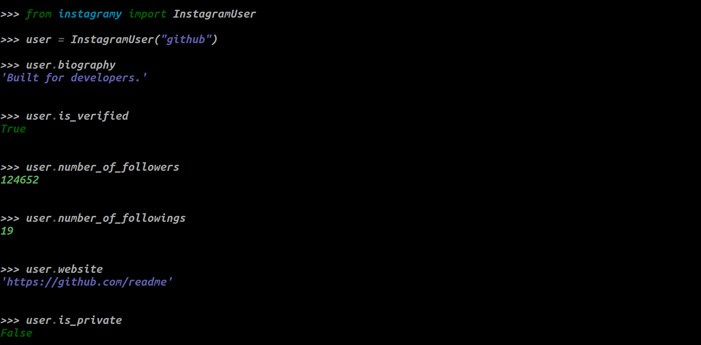
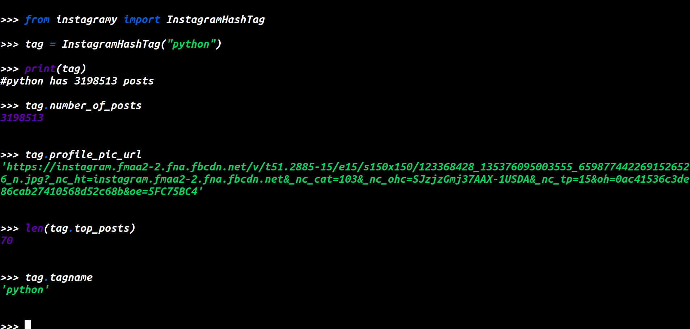
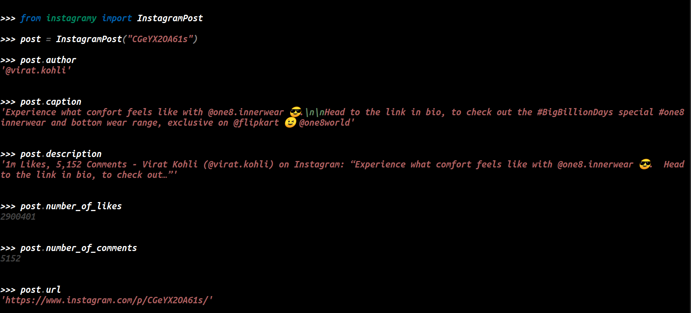
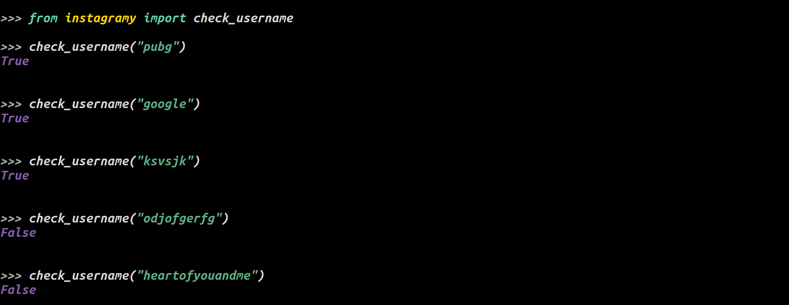
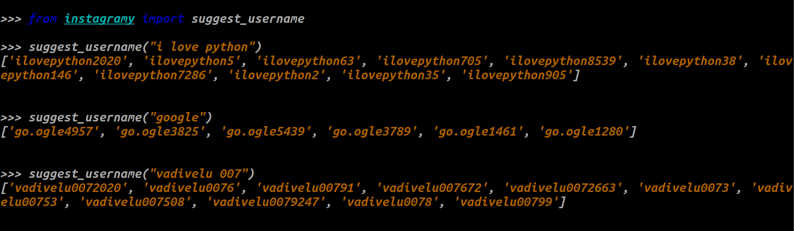

# instagramy

🌱

 

Scrape Instagram Users Informations, Posts Details and Hashtags details. This Package scrape the user's recent posts with some information like likes, comment, caption and etc. No login required.

 

## Download

### Windows

`> pip install instagramy`

### Linux

`$ pip3 install instagramy`

## Usage

### Instagram User details

### Instagram Hashtag details

### Instagram Post details

### Check Username is in Instagram

### Suggest Username for Instagram

### Sample-Scripts

- [👦 Download Instagram DP](https://github.com/yogeshwaran01/Python-Scripts/blob/master/Scripts/instadp.py)

- [📊 Analysis Instagram Accounts with Matplotlib](https://github.com/yogeshwaran01/Python-Scripts/blob/master/Scripts/instalysis.py)

- [#️⃣ Bulk Instagram Hashtag Posts Download](https://github.com/yogeshwaran01/Python-Scripts/blob/master/Scripts/instagram_hastags_post.py)

### Documentation

[📖 Click Here](https://yogeshwaran01.herokuapp.com/post?id=2)
